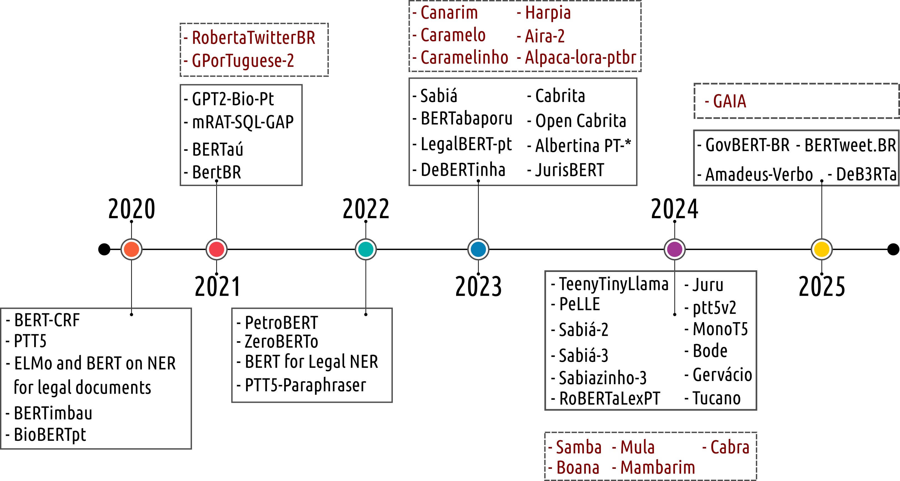

<div align="center">


## Large Languages Models in Brazilian Portuguese: A Chronological Survey

</div>

## 🎉 News

- **[2025-xx-xx]** 🔥 We are excited to introduce our chronological survey that collects papers and projects on Brazilian Portuguese LLMs!

## 🎈 Citation

If you find this survey helpful, please cite our work:

```bibtex
@article{Cruz-Castañeda_Amadeus_2025,
  title={Large Languages Models in Brazilian Portuguese: A Chronological Survey},
  volume={31},
  url={https://journals-sol.sbc.org.br/index.php/jbcs/article/view/5789},
  DOI={10.5753/jbcs.2025.5789},
  number={1},
  journal={Journal of the Brazilian Computer Society},
  author={Cruz-Castañeda, William Alberto and Amadeus, Marcellus},
  year={2025},
  month={Oct.},
  pages={1168–1187}
}
```

## 📖 Contents
- [Large Languages Models in Brazilian Portuguese: A Chronological Survey](#llms-brazilian-portuguese-chronological-survey)
- [🎉 News](#-news)
- [🎈 Citation](#-citation)
- [📖 Contents](#-contents)
- [🗺️ Overview](#️-overview)
- [📄 PT-BR-LLMs List](#-pt-br-llms-list)
  - [2020 Models](#2020-models)
  - [2021 Models](#2021-models)
  - [2022 Models](#2022-models)
  - [2023 Models](#2023-models)
  - [2024 Models](#2024-models)
  - [2025 Models](#2025-models)

## 🗺️ Overview

Our survey provides a chronological examination of **Brazilian Portuguese LLMs**.

<p align="center">
   
</p>

We organize the survey into the following main sections:

1. <u>PT-BR-LLMs produced in 2020</u>
2. <u>PT-BR-LLMs produced in 2021</u>
3. <u>PT-BR-LLMs produced in 2022</u>
4. <u>PT-BR-LLMs produced in 2023</u>
5. <u>PT-BR-LLMs produced in 2024</u>
6. <u>PT-BR-LLMs produced in 2025</u>

## 📄 PT-BR-LLMs List

### 2020 Models

| Name | Title | Paper | Github |
|:-:|:-|:-:|:-:|
| `BERT-CRT` | Portuguese Named Entity Recognition using BERT-CRF | [](https://arxiv.org/abs/1909.10649) | [](https://github.com/neuralmind-ai/portuguese-bert) |
| `PTT5` | Pretraining and validating the T5 model on Brazilian Portuguese data | [](https://arxiv.org/abs/2008.09144) | [](https://github.com/unicamp-dl/PTT5) |
| `ELMo and BERT on NER for legal documents` | A Study on the Impact of Intradomain Finetuning of Deep Language Models for Legal Named Entity Recognition in Portuguese | [](https://link.springer.com/chapter/10.1007/978-3-030-61377-8_46) |  |
| `BERTimbau` | BERTimbau: Pretrained BERT Models for Brazilian Portuguese | [](https://link.springer.com/chapter/10.1007/978-3-030-61377-8_28) | [](https://github.com/neuralmind-ai/portuguese-bert) |
| `BioBERTpt` | BioBERTpt - A Portuguese Neural Language Model for Clinical Named Entity Recognition | [](https://aclanthology.org/2020.clinicalnlp-1.7) | [](https://github.com/HAILab-PUCPR/BioBERTpt) |

### 2021 Models

| Name | Title | Paper | Github |
|:-:|:-|:-:|:-:|
| `GPT2-Bio-Pt` | A GPT-2 Language Model for Biomedical Texts in Portuguese | [](https://doi.org/10.1109/CBMS52027.2021.00056) | [](https://github.com/HAILab-PUCPR/gpt2-bio-pt) |
| `mRAT-SQL+GAP` | mRAT-SQL+GAP: A Portuguese Text-to-SQL Transformer | [](https://doi.org/10.1007/978-3-030-91699-2_35) | [](https://github.com/C4AI/gap-text2sql) |
| `BERTaú` | BERTaú: Itaú BERT for digital customer service | [](https://arxiv.org/abs/2101.12015) | |
| `BertBR` | BertBR : a pretrained language model for law texts | [](https://bdm.unb.br/handle/10483/27824)  | |

#### without Publication
| Name |  Github |
|:-:|:-|
| `RobertaTwitterBR` | [](https://huggingface.co/verissimomanoel/RobertaTwitterBR) | 
| `GPorTuguese-2` | [](https://huggingface.co/pierreguillou/gpt2-small-portuguese) |  

### 2022 Models

| Name | Title | Paper | Github |
|:-:|:-|:-:|:-:|
| `PetroBERT` | PetroBERT: A Domain Adaptation Language Model for Oil and Gas Applications in Portuguese | [](https://doi.org/10.1007/978-3-030-98305-5_10) | |
| `ZeroBERTo` | ZeroBERTo: Leveraging Zero-Shot Text Classification by Topic Modeling | [](https://doi.org/10.1007/978-3-030-98305-5_12) | |
| `BERT models for legal NER` | Fostering Judiciary Applications with New Fine-Tuned Models for Legal Named Entity Recognition in Portuguese | [](https://doi.org/10.1007/978-3-030-98305-5_21) | |
| `PTT5-Paraphraser` | PTT5-Paraphraser: Diversity and Meaning Fidelity in Automatic Portuguese Paraphrasing | [](https://doi.org/10.1007/978-3-030-98305-5_28) | [](https://github.com/lucasfaop/ptt5_paraphraser) |

### 2023 Models

| Name | Title | Paper | Github |
|:-:|:-|:-:|:-:|
| `Sabiá` | Sabiá: Portuguese Large Language Models | [](https://doi.org/10.1007/978-3-031-45392-2_15) | |
| `BERTabaporu` | BERTabaporu: Assessing a Genre-Specific Language Model for Portuguese NLP | [](https://aclanthology.org/2023.ranlp-1.24) | [](https://huggingface.co/pablocosta/bertabaporu-base-uncased) |
| `LegalBert-pt` | LegalBert-pt: A Pretrained Language Model for the Brazilian Portuguese Legal Domain | [](https://doi.org/10.1007/978-3-031-45392-2_18) | [](https://huggingface.co/raquelsilveira/legalbertpt_fp) [](https://huggingface.co/raquelsilveira/legalbertpt_sc) |
| `DeBERTinha` | DeBERTinha: A Multistep Approach to Adapt DebertaV3 XSmall for Brazilian Portuguese Natural Language Processing Task | [](https://arxiv.org/abs/2309.16844) | [](https://huggingface.co/sagui-nlp/debertinha-ptbr-xsmall) |
| `Cabrita` | Cabrita: closing the gap for foreign languages | [](https://arxiv.org/abs/2308.11878) | [](https://huggingface.co/22h/open-cabrita3b) |
| `Albertina PT-*` | Advancing Neural Encoding of Portuguese with Transformer Albertina PT-* | [](http://dx.doi.org/10.1007/978-3-031-49008-8_35) | [](https://huggingface.co/PORTULAN/albertina-900m-portuguese-ptbr-encoder-brwac) |
| `JurisBERT` | JurisBERT: A New Approach that Converts a Classification Corpus into an STS One | [](https://doi.org/10.1007/978-3-031-36805-9_24) | [](https://huggingface.co/alfaneo) |

#### without Publication
| Name |  Github |
|:-:|:-|
| `Canarim` | [](https://huggingface.co/collections/dominguesm/canarim-models-657efdf4f5eacd4bda0cb77b) |  
| `Caramelo, Caramelinho, and Harpia` | [](https://huggingface.co/Bruno) |  
| `Aira-2` | [](https://huggingface.co/nicholasKluge) |  
| `Alpaca-lora-ptbr` | [](https://huggingface.co/dominguesm/alpaca-lora-ptbr-7b) |  

### 2024 Models

| Name | Title | Paper | Github |
|:-:|:-|:-:|:-:|
| `TeenyTinyLlama` | TeenyTinyLlama: Open-source tiny language models trained in Brazilian Portuguese | [](http://dx.doi.org/10.1016/j.mlwa.2024.100558) | [](https://github.com/Nkluge-correa/TeenyTinyLlama) [](https://huggingface.co/collections/nicholasKluge/teenytinyllama-6582ea8129e72d1ea4d384f1) |
| `PeLLE` | PeLLE: Encoder-based language models for Brazilian Portuguese based on open data | [](https://arxiv.org/abs/2402.19204) | |
| `Sabiá-2` | Sabiá-2: A New Generation of Portuguese Large Language Models | [](https://arxiv.org/abs/2403.09887) | |
| `Bode` | Introducing Bode: A Fine-Tuned Large Language Model for Portuguese Prompt-Based Task | [](https://arxiv.org/abs/2401.02909) | [](https://huggingface.co/collections/recogna-nlp/bode-llm-em-portugues-65b97aa411162bf34f8da221) |
| `Juru` | Juru: Legal Brazilian Large Language Model from Reputable Sources | [](https://arxiv.org/abs/2403.18140) | [](https://huggingface.co/roseval/Juru-7B) |
| `ptt5-v2 / MonoT5` | ptt5-v2: A Closer Look at Continued Pretraining of T5 Models for the Portuguese Language | [](https://arxiv.org/abs/2406.10806) [](https://doi.org/10.1007/978-3-031-79032-4_23) | [](https://huggingface.co/unicamp-dl) |
| `Gervácio` | Advancing Generative AI for Portuguese with Open Decoder Gervásio PT* | [](https://aclanthology.org/2024.sigul-1.3) | [](https://huggingface.co/PORTULAN/gervasio-7b-portuguese-ptbr-decoder) |
| `Sabiá-3 / Sabiazinho-3` | Sabiá-3 Technical Report | [](https://arxiv.org/abs/2410.12049) | |
| `Tucano` | Tucano: Advancing Neural Text Generation for Portuguese | [](https://arxiv.org/abs/2411.07854) [](https://doi.org/10.1016/j.patter.2025.101325) | [](https://huggingface.co/TucanoBR) |
| `RoBERTaLexPT` | RoBERTaLexPT: A Legal RoBERTa Model pretrained with deduplication for Portuguese | [](https://aclanthology.org/2024.propor-1.38) | |

#### without Publication
| Name |  Github |
|:-:|:-|
| `Cabra` | [](https://huggingface.co/botbot-ai/Cabra) |  
| `Samba` | [](https://huggingface.co/lrds-code/samba-1.1B) | 
| `Boana` | [](https://huggingface.co/lrds-code/boana-7b-instruct) | 
| `Mula` |  | 
| `Mambarim` | [](https://huggingface.co/dominguesm/mambarim-110m) | 

### 2025 Models

| Name | Title | Paper | Github |
|:-:|:-|:-:|:-:|
| `GovBERT-BR` | GovBERT-BR: A BERT-Based Language Model for Brazilian Portuguese Governmental Data | [](https://doi.org/10.1007/978-3-031-79032-4_2) | [](https://huggingface.co/dccmpmgfinalisticas/GovBERT-BR) |
| `BERTweet.BR` | BERTweet.BR: a pre-trained language model for tweets in Portuguese | [](https://doi.org/10.1007/s00521-024-10711-3) | [](https://huggingface.co/melll-uff/bertweetbr) |
| `DeB3RTa` | DeB3RTa: A Transformer-Based Model for the Portuguese Financial Domain | [](https://www.mdpi.com/2504-2289/9/3/51) | [](https://huggingface.co/higopires/DeB3RTa-base) |
| `Amadeus-Verbo` | Amadeus-Verbo Technical Report: The powerful Qwen2.5 family models trained in Portuguese | [](https://arxiv.org/abs/2506.00019) | [](https://huggingface.co/collections/amadeusai/amadeus-verbo-qwen25-pt-br-powered-by-aws-67cf2e7aae69ce2b3bcdcfda) |

#### without Publication
| Name | Github |
|:-:|:-|
| `GAIA` | [](https://huggingface.co/CEIA-UFG/Gemma-3-Gaia-PT-BR-4b-it) | 

