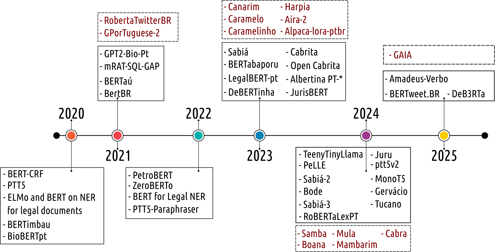

<div align="center">


## Large Languages Models in Brazilian Portuguese: A Chronological Survey

</div>

## 🎉 News

- **[2025-xx-xx]** 🔥 We are excited to introduce a chronological survey that collects papers and projects on Brazilian Portuguese LLMs!

## 🎈 Citation

If you find this survey helpful, please cite our work:

```bibtex
@article{2025survey,
  title={},
  author={Others},
  journal={},
  year={2025}
}
```

## 📖 Contents
- [Large Languages Models in Brazilian Portuguese: A Chronological Survey](#llms-brazilian-portuguese-chronological-survey)
- [🎉 News](#-news)
- [🎈 Citation](#-citation)
- [📖 Contents](#-contents)
- [🗺️ Overview](#️-overview)
- [📄 PT-BR-LLMs List](#-paper-list)
  - [2020 Models](#2020-models)
  - [2021 Models](#2021-models)
  - [2022 Models](#2022-models)
  - [2023 Models](#2023-models)
  - [2024 Models](#2024-models)
  - [2025 Models](#2025-models)
  

## 🗺️ Overview

Our survey provides a chronological examination of **Brazilian Portuguese LLMs**.

<p align="center">
   
</p>

We organize the survey into the following main sections:

1. <u>PT-BR-LLMs produced in 2020</u>
2. <u>PT-BR-LLMs produced in 2021</u>
3. <u>PT-BR-LLMs produced in 2022</u>
4. <u>PT-BR-LLMs produced in 2023</u>
5. <u>PT-BR-LLMs produced in 2024</u>
6. <u>PT-BR-LLMs produced in 2025</u>

## 📄 PT-BR-LLMs List

### 2020 Models

| Name | Title | Paper | Github |
|:-:|:-|:-:|:-:|
| `BERT-CRT` | Portuguese Named Entity Recognition using BERT-CRF | [](https://arxiv.org/abs/1909.10649) | [](https://github.com/neuralmind-ai/portuguese-bert) |
| `PTT5` | Pretraining and validating the T5 model on Brazilian Portuguese data | [](https://arxiv.org/abs/2008.09144) | [](https://github.com/unicamp-dl/PTT5) |
| `ELMo and BERT on NER for legal documents` | A Study on the Impact of Intradomain Finetuning of Deep Language Models for Legal Named Entity Recognition in Portuguese | [](https://link.springer.com/chapter/10.1007/978-3-030-61377-8_46) |  |
| `BERTimbau` | BERTimbau: Pretrained BERT Models for Brazilian Portuguese | [](https://link.springer.com/chapter/10.1007/978-3-030-61377-8_28) | [](https://github.com/neuralmind-ai/portuguese-bert) |
| `BioBERTpt` | BioBERTpt - A Portuguese Neural Language Model for Clinical Named Entity Recognition | [](https://aclanthology.org/2020.clinicalnlp-1.7) | [](https://github.com/HAILab-PUCPR/BioBERTpt) |

### 2021 Models

| Name | Title | Paper | Github |
|:-:|:-|:-:|:-:|
| `GPT2-Bio-Pt` | A GPT-2 Language Model for Biomedical Texts in Portuguese | [](https://doi.org/10.1109/CBMS52027.2021.00056) | [](https://github.com/HAILab-PUCPR/gpt2-bio-pt) |
| `mRAT-SQL+GAP` | mRAT-SQL+GAP: A Portuguese Text-to-SQL Transformer |  | |
| `BERTaú` | BERTaú: Itaú BERT for digital customer service |  | |
| `BertBR` | BertBR : a pretrained language model for law texts |  | |

### without Publication
| Name | Title | Github |
| `RobertaTwitterBR` |  |  | 
| `GPorTuguese-2` |  |  | 
| `GPorTuguese-2` |  |  | 

### 2022 Models

| Name | Title | Paper | Github |
|:-:|:-|:-:|:-:|
| `PetroBERT` | PetroBERT: A Domain Adaptation Language Model for Oil and Gas Applications in Portuguese |  | |
| `ZeroBERTo` | ZeroBERTo: Leveraging Zero-Shot Text Classification by Topic Modeling |  | |
| `BERT models for legal NER` | Fostering Judiciary Applications with New Fine-Tuned Models for Legal Named Entity Recognition in Portuguese |  | |
| `PTT5-Paraphraser` | PTT5-Paraphraser: Diversity and Meaning Fidelity in Automatic Portuguese Paraphrasing |  | |

### 2023 Models

| Name | Title | Paper | Github |
|:-:|:-|:-:|:-:|
| `Sabiá` | Sabiá: Portuguese Large Language Models |  | |
| `BERTabaporu` | BERTabaporu: Assessing a Genre-Specific Language Model for Portuguese NLP |  | |
| `LegalBert-pt` | LegalBert-pt: A Pretrained Language Model for the Brazilian Portuguese Legal Domain |  | |
| `DeBERTinha` | DeBERTinha: A Multistep Approach to Adapt DebertaV3 XSmall for Brazilian Portuguese Natural Language Processing Task |  | |
| `Cabrita` | Cabrita: closing the gap for foreign languages |  | |
| `Albertina PT-*` | Advancing Neural Encoding of Portuguese with Transformer Albertina PT-* |  | |
| `JurisBERT` | JurisBERT: A New Approach that Converts a Classification Corpus into an STS One |  | |

### without Publication
| Name | Title | Github |
| `Canarim` |  |  | 
| `Caramelo, Caramelinho, and Harpia` |  |  | 
| `Aira-2` |  |  | 
| `Alpaca-lora-ptbr` |  |  | 

### 2024 Models

| Name | Title | Paper | Github |
|:-:|:-|:-:|:-:|
| `TeenyTinyLlama` | TeenyTinyLlama: Open-source tiny language models trained in Brazilian Portuguese |  | |
| `PeLLE` | PeLLE: Encoder-based language models for Brazilian Portuguese based on open data |  | |
| `Sabiá-2` | Sabiá-2: A New Generation of Portuguese Large Language Models |  | |
| `Bode` | Introducing Bode: A Fine-Tuned Large Language Model for Portuguese Prompt-Based Task |  | |
| `Juru` | Juru: Legal Brazilian Large Language Model from Reputable Sources |  | |
| `ptt5-v2 / MonoT5` | ptt5-v2: A Closer Look at Continued Pretraining of T5 Models for the Portuguese Language |  | |
| `Gervácio` | Advancing Generative AI for Portuguese with Open Decoder Gervásio PT* |  | |
| `Sabiá-3 / Sabiazinho-3` | Sabiá-3 Technical Report |  | |
| `Tucano` | Tucano: Advancing Neural Text Generation for Portuguese |  | |
| `RoBERTaLexPT` | RoBERTaLexPT: A Legal RoBERTa Model pretrained with deduplication for Portuguese |  | |

### without Publication
| Name | Title | Github |
| `Cabra` |  |  | 
| `Samba` |  |  | 
| `Boana` |  |  | 
| `Mula` |  |  | 
| `Mambarim` |  |  | 

### 2025 Models

| Name | Title | Paper | Github |
|:-:|:-|:-:|:-:|
| `BERTweet.BR` | BERTweet.BR: a pre-trained language model for tweets in Portuguese |  | |
| `DeB3RTa` | DeB3RTa: A Transformer-Based Model for the Portuguese Financial Domain |  | |
| `Amadeus-Verbo` | Amadeus-Verbo Technical Report: The powerful Qwen2.5 family models trained in Portuguese |  | |

### without Publication
| Name | Title | Github |
| `GAIA` |  |  | 

